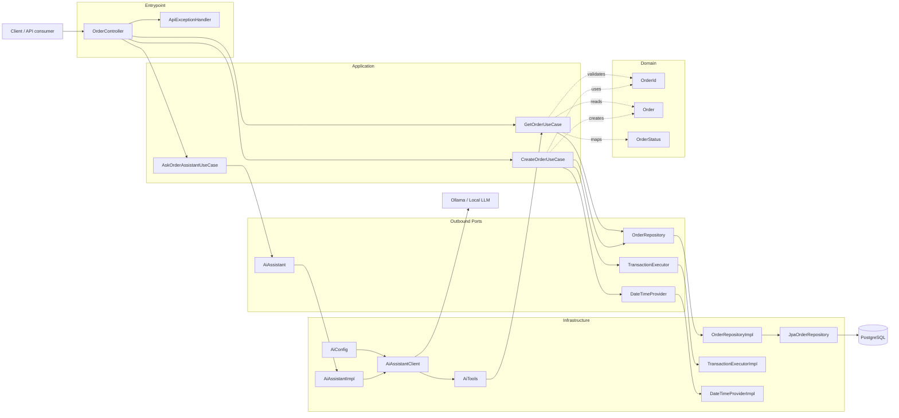
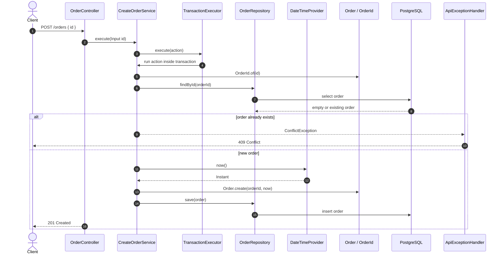
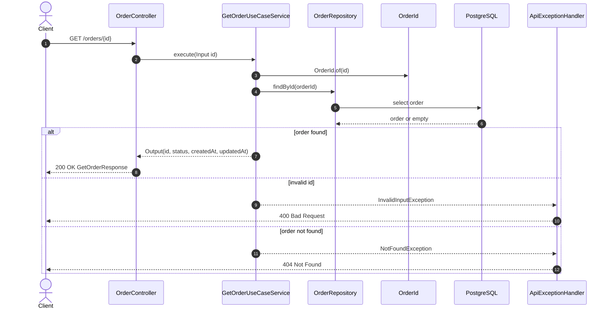
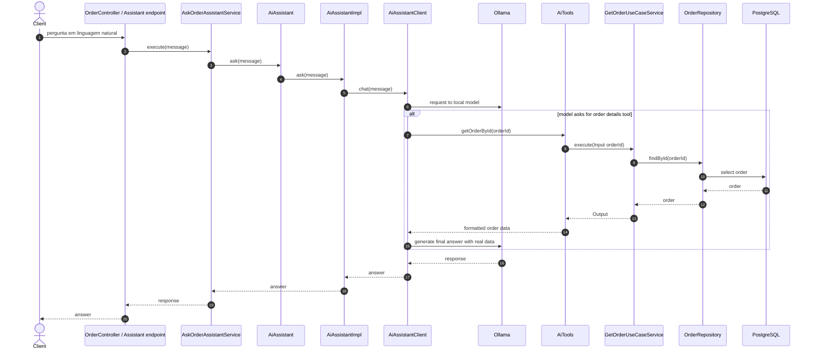

# Order Chatbot Project Flow

Este documento resume o fluxo principal do `order-service`, incluindo os endpoints HTTP, os casos de uso da aplicacao, o dominio, a persistencia em PostgreSQL e o fluxo opcional do assistente com LangChain4j/Ollama.

## Visao Geral

## Fluxo de Criacao de Pedido

## Fluxo de Consulta de Pedido

## Fluxo do Assistente com IA

## Observacoes

- A camada `domain` nao depende de Spring, banco ou IA.
- Os casos de uso ficam na camada `application` e dependem de portas, nao de implementacoes concretas.
- A persistencia fica atras da porta `OrderRepository`.
- A integracao com IA deve ficar isolada na infraestrutura e idealmente condicionada por `app.ai.enabled=true`, para nao quebrar testes de integracao.
- O assistente deve usar casos de uso existentes, como `GetOrderUseCase`, em vez de acessar o banco diretamente.
